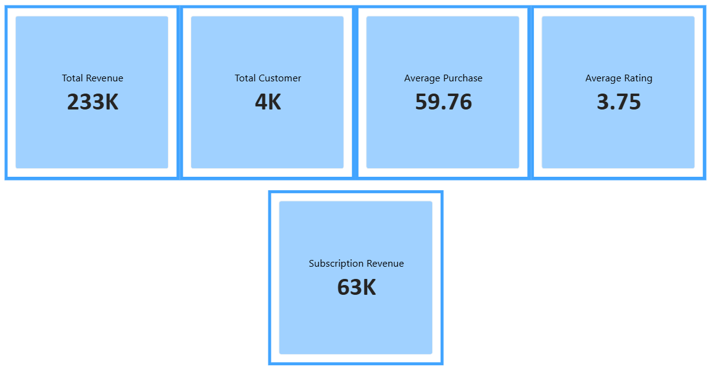
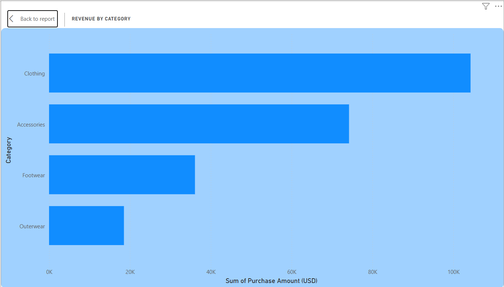
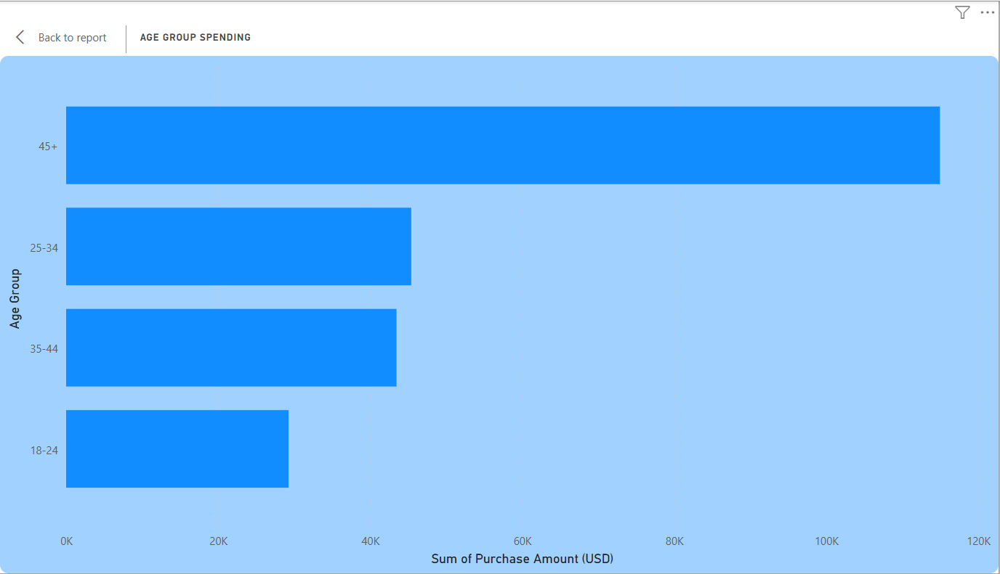
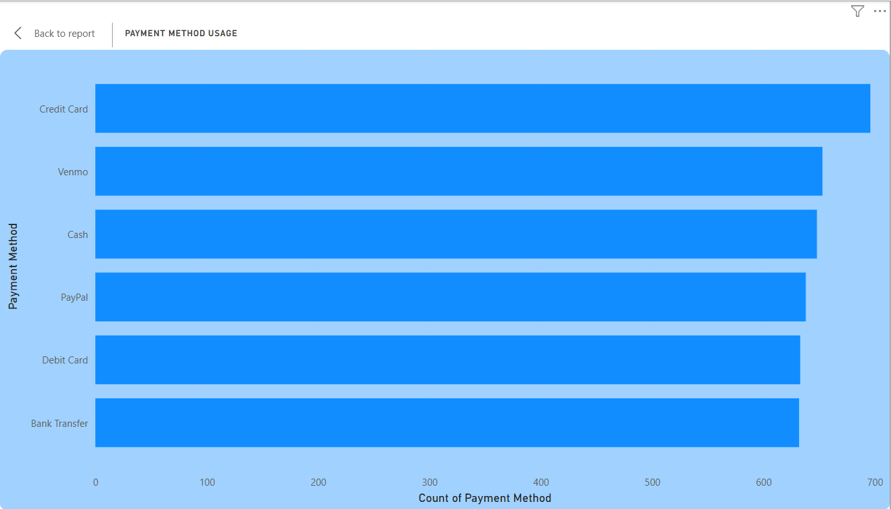
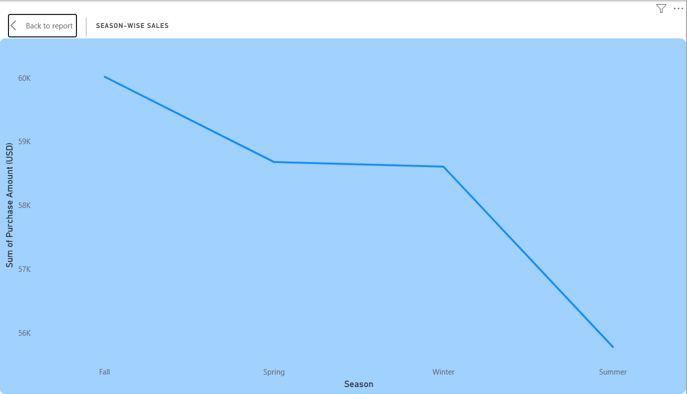
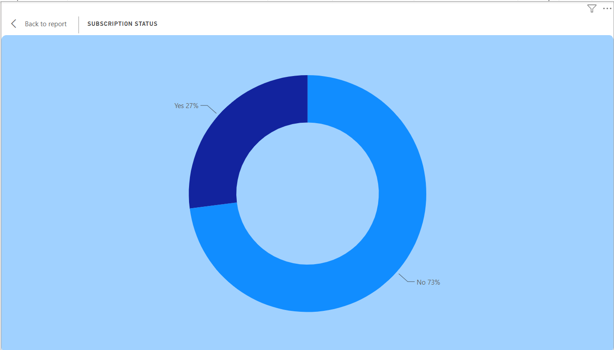

**# Customer Shopping Behavior Analysis**

**Overview:**
This project analyzes customer shopping trends to uncover insights into spending patterns, product categories, customer loyalty, payment preferences, and seasonal behavior.

## Project Workflow
1. Data Cleaning in Excel
2. Data Validation and Standardization
3. SQL Analysis for KPIs and Business Questions
4. Exploratory Data Analysis using Python
5. Dashboard Creation in Power BI

## Skills Demonstrated
- Data Cleaning
- Data Validation
- Data Transformation
- SQL Aggregations
- CTEs and Subqueries
- KPI Reporting
- Trend Analysis
- Customer Segmentation
- Data Visualization
- Dashboard Design

**Tools Used:**

**1. Excel:**

* Cleaning
* Formulas
* Pivot tables
* Business summarization

**2. SQL:**

* Aggregation
* CASE WHEN
* Business logic
* Ranking
* KPI extraction

**3. Python:**

* EDA
* Grouping
* Binning
* Visualization

**3. Power BI**

* KPI Cards - Total Revenue, Total Customers, Average Purchase, Average Rating
* Charts
* Slicers

  ## Dashboard Preview

### KPI Cards

### Revenue by Category

### Age Group Spending

### Payment Method Analysis

### Seasonal Sales

### Subscription Status

**Questions**

* Which category generates the most revenue?
* Which age group spends the most?
* Which season has the highest sales?
* What payment method is most used?
* Do loyal customers spend more?

**Final Insights**

* Clothing generated highest revenue
* Fall showed strongest purchasing activity
* Card payments dominated customer preference
* No Subscription customers spent more on average
* No Discounted purchases had higher average order values
* Customers aged 45+ were the highest spenders
* Loyal and Regular customers spend nearly equal.

## Author
Poonam Koundal
Transitioning to Data Analyst

